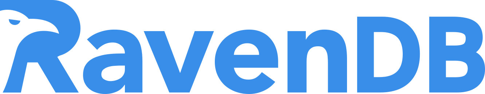

# Olá, eu sou o Julio! 🚀  

💻 **Cargo:** Analista de Sistemas I na [Invent Software](https://inventsoftware.com.br/)  
📕 **Formação:** Análise e Desenvolvimento de Sistemas – [Centro Universitário de Goiás (UNIGOIÁS)](https://unigoias.com.br/)  
📧 **Contato:** [julio.all@outlook.com](mailto:julio.all@outlook.com)  
🐍 **Curiosidade:** Minha jornada na programação começou com Python!  

## 🚀 Tecnologias e Ferramentas  
🔹 **Tech Stack:** .NET | Angular | C# | TypeScript | RavenDB  

## 🎮 Interesses  
- Desenvolvimento de jogos (Godot, Unity, GameMaker, Roblox)  
- Exploração de novas tecnologias  
- Aprimoramento contínuo e crescimento profissional  

💡 Vamos trocar conhecimento! 🚀  

 

 
  
  
  
 
  
  
  
 

  ##
 

 
  
  
  
 

##

